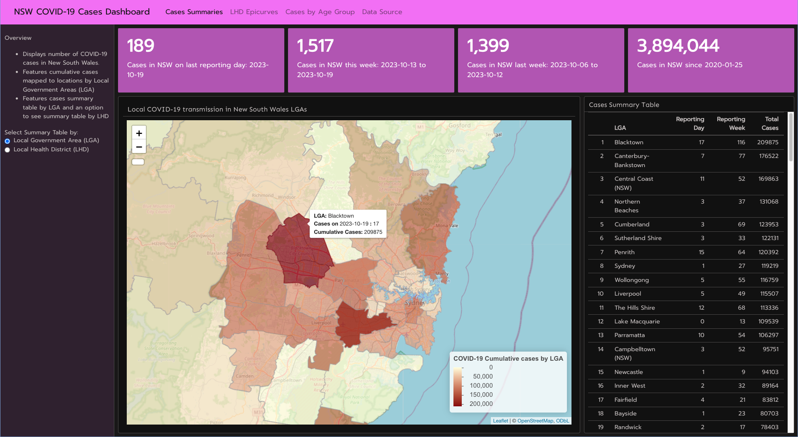
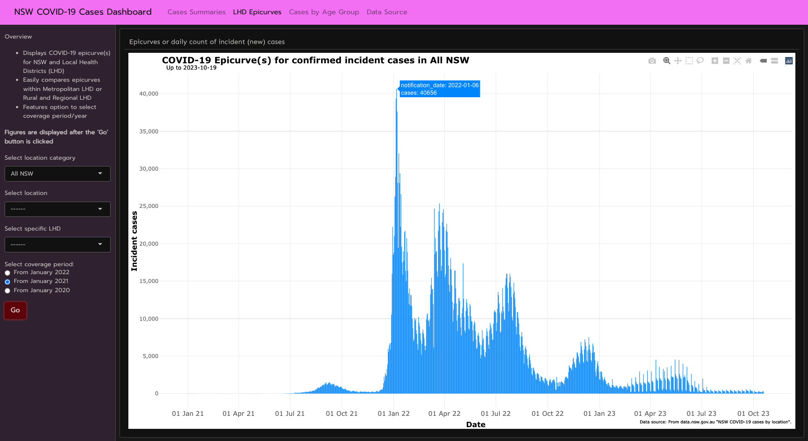
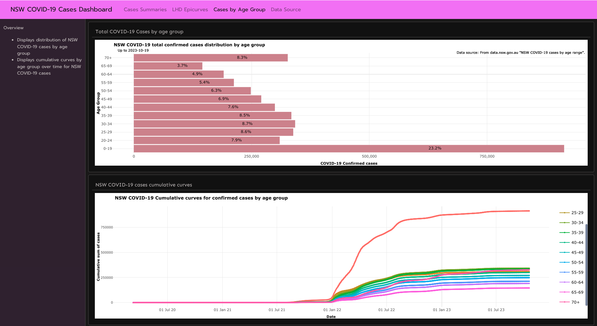

# New South Wales COVID-19 Cases Dashboard 

***
#### Description 

**Link to the Dashboard**

* *Access the dashboard here:* [New South Wales COVID-19 Cases Dashboard](https://mmg1217.shinyapps.io/nsw_covid_dashboard/){:target="_blank"}

***

#### Functionality

**A. Case Summaries**

**B. Epicurves**

**C. Cases by age group**

 

***Data source***

* The datasets were  sourced from a NSW government site - Data.NSW (https://data.nsw.gov.au/). 
* The datasets used were: (i) "NSW COVID-19 cases by location"; and (ii) "NSW COVID-19 cases by age range"

***

#### Preview

 

**Case Summaries**

 

**Epicurves**

 

**Epicurves**

 

**Cases by age group**

